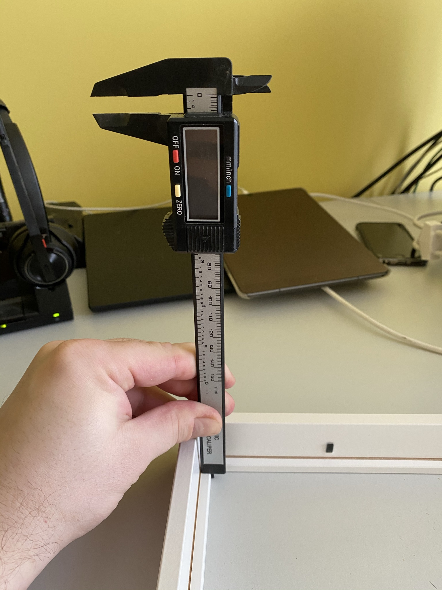

# Touch Screen Controller for Home Assistant
## Intro
This is a project to assemble a touchscreen controller for Home Assistant. The project contains a detailed guide on what and how to do both hardware and software wise.

I have been looking into this for quiet some time now. Checked the tablet possibilities & Raspberry along with enclousre possibilities. Ideally I would go with a tablet since that is having all the sensors I would need but I am afraid of the lifetime of such solution because even if we control the charging cycles I do not think the battery would survive more than 2-3 years.

Therefore I am planning to use PoE based solution. For now I am using this project to track the progress and to make notes. Later on I plan to share this on different forums, hopefully it will be useful for the other people out there wanting to do something similar. :-)

## Table of Contents
- [Touch Screen Controller for Home Assistant](#touch-screen-controller-for-home-assistant)
  - [Intro](#intro)
  - [Table of Contents](#table-of-contents)
  - [Tools](#tools)
  - [Hardware](#hardware)
    - [Table of the used components](#table-of-the-used-components)
    - [Components in details](#components-in-details)
      - [Frame](#frame)
      - [Wooden Plank, Plugs & Glue](#wooden-plank-plugs--glue)
      - [Black Film](#black-film)
      - [Double-Sided Tape for LCD](#double-sided-tape-for-lcd)
      - [Adhesive sealing tape](#adhesive-sealing-tape)
      - [Polystyrene Sheet, PCB Board Support Holder, Cable Tie Holder and Cable Tie](#polystyrene-sheet-pcb-board-support-holder-cable-tie-holder-and-cable-tie)
      - [Raspberry PI 4](#raspberry-pi-4)
      - [Touch Screen](#touch-screen)
      - [HDMI Cable](#hdmi-cable)
      - [Power Supply, PoE, Step-down, Reset Button & Reset Button Cable & WAGO](#power-supply-poe-step-down-reset-button--reset-button-cable--wago)
      - [Ambient Light Sensor](#ambient-light-sensor)
      - [Motion sensor](#motion-sensor)
      - [Amplifier, Speaker, Jack cable, Microphone](#amplifier-speaker-jack-cable-microphone)
      - [Jumper Cables and Double Row Pin Header](#jumper-cables-and-double-row-pin-header)
  - [Assembly](#assembly)
  - [Software](#software)
  - [Credits](#credits)

## Tools
| Name                                        | Note                                                             |
| ------------------------------------------- | ---------------------------------------------------------------- |
| [Small Clips](https://tinyurl.com/y7fctjrn) | This will come in handy when I will need to glue things together |

## Hardware
### Table of the used components
Some of the links are pointing to local dealerships here in Hungary. Most of these are also available on Aliexpress or probably locally in your country.

| Hardware                  | Type & Link                                                                                       |
| ------------------------- | ------------------------------------------------------------------------------------------------- |
| ~~Frame~~                 | ~~[IKEA Ribba 21x30](https://www.ikea.com/hu/hu/p/ribba-kepkeret-fekete-60378396/)~~              |
| Frame                     | TBD                                                                                               |
| Wooden Plank              | [10x15](https://www.obi.hu/szegelylecek/negyszoeglec-10-mm-x-15-mm-2100-mm-fenyo/p/1820299)       |
| Wooden Plugs              | [6mm Wooden Plug](https://www.obi.hu/fatiplik/lux-fatipli-6-mm-50-darab/p/5103932)                |
| Wood Glue                 | [BISON Super Wood Glue](https://tinyurl.com/ybyvgavx)                                             |
| Black Film                | [One-Way Black mirror film 20cm x 5m](https://www.aliexpress.com/item/4000478606134.html)         |
| Double-Sided Tape for LCD | [3M 9448AB Tape for LCD - 2mm & 5mm](https://www.aliexpress.com/item/32877319852.html)            |
| Adhesive Sealing Tape     | [2 x 8 Adhesive Silicone Sealing Tape](https://www.aliexpress.com/item/32812526331.html)          |
| Polystyrene Sheet         | [330 x 230 x 0.5 Polystyrene Sheet](https://tinyurl.com/ydd37cmu)                                 |
| PCB Board Support Holder  | [3.5mm Sticky Holder](https://www.hestore.hu/prod_10035400.html#)                                 |
| Cable Tie Holder          | [4.2mm Stickly Holder](https://www.hestore.hu/prod_10027865.html)                                 |
| Cable Tie                 | [2.5mm Cable Tie](https://www.hestore.hu/prod_10023376.html)                                      |
| Raspberry PI 4            | [Model B - 4GB](https://www.rpibolt.hu/raspberry-pi-4-model-b-4gb)                                |
| Touch Screen              | [13.3 FHD Capacitive HDMI](https://www.aliexpress.com/item/32767308281.html)                      |
| HDMI Cable                | [HDMI Ribbon Cable (A1, D1, 5 & 10CM FPC)](https://www.aliexpress.com/item/1005001592198090.html) |
| Power Supply              | [42W Power Supply](https://www.anrodiszlec.hu/product_info.php/products_id/13212)                 |
| PoE Adapter & Splitter    | [POE Adapter-Splitter Kit](https://www.aliexpress.com/item/4000519288151.html)                    |
| DC/DC Step-down           | [DCDC-6010-M](https://www.hestore.hu/prod_10038452.html)                                          |
| Reset Button              | [NO 16mm flat button](https://www.aliexpress.com/item/4001040355688.html)                         |
| Reset Button Cable        | [Switch connector cable](https://www.aliexpress.com/item/32917680168.html)                        |
| Ambient Light Sensor      | [BH1750](https://www.hestore.hu/prod_10038183.html)                                               |
| Motion sensor / Gesture   | [APDS-9960](https://tinyurl.com/y384b65v)                                                         |
| Amplifier                 | [PAM8403-M](https://www.hestore.hu/prod_10038182.html)                                            |
| Speaker                   | [3W Passive mini speaker](https://www.aliexpress.com/item/1005001560611822.html)                  |
| Microphone                | [Omnidirectional USB-C Mic](https://www.aliexpress.com/item/4001295620668.html)                   |
| Jack Cable                | [Random 3.5 Jack Cable on Ali](https://www.aliexpress.com/item/1005001967948299.html)             |
| Jumper Cable 100          | [Female - Female 10cm Jumper Cable](https://www.hestore.hu/prod_10036628.html)                    |
| Jumper Cable 200          | [Female - Female 20cm Jumper Cable](https://www.hestore.hu/prod_10035719.html)                    |
| Double Row Pin Header     | [Double Row Pin Header](https://www.hestore.hu/prod_10024169.html)                                |

### Components in details
#### Frame
~~Based on the guide I linked in the [Credits](#credits) I have found that IKEA Ribba is close to the perfect choice to do something like this. It is having a depth of 3.5 cm which is allowing us to hide most of the stuff we are planning with and still have some space for the air flow. Opposed to the already mentioned guide I am not planning to glue two frames; I am planning to use it as it is.~~

  
<s>Measurements (mm)</s>

  <ul>
    <li><s>Outer diameters: 324 x 234 x 35</s></li>
    <li><s>Inner diameters (visible picture size): 287 x 197</s></li>
    <li><s>Inner diameters (without frame edge): 303 x 213 x 30</s></li>
    <li><s>Frame edge: 7 x 7</s></li>
  </ul>

  
<s>Pictures</s>

   
   
   
   
   
   
   

Solution: TBD

#### Wooden Plank, Plugs & Glue
The wooden plank will help us to give some more strength and stability to the screen by pushing it against the frame/glass. Along with that it will enable us used together with the plugs to mount it on the wall and be able to remove it from the wall later on in case something needs to be adjusted physically. The planks will be glued to the backside of the Ribba frame which will be mounted on the wall with 4 screws.

  
Pictures

     
     
     

#### Black Film
This is similar to the one-way mirror / detective glass films but instead of being a normal mirror it is a black/darker mirror. I believe that the look of this is similar to the tablet / phone black edge around or top of the screen. This will help us to hide the sensors.

#### Double-Sided Tape for LCD
This will help us to give the LCD a better look by filling the potential gaps between the frame and the screen. Since this is adhesive it will also help to keep the LCD inside the frame.

#### Adhesive sealing tape
This will be used on the edge of the frame (between the wall and the Ribba frame). This is matching the color of the frame and will make the solution prettier by filling the potential gaps between the wall and the frame.

#### Polystyrene Sheet, PCB Board Support Holder, Cable Tie Holder and Cable Tie
The sheet is a very thin dielectric material what I will place between the back of the LCD and the rest of the solution. The board sticky holders will be placed on the sheet providing stable support to the LCD driver boards and to the RPi. I like clean solutions so for cable organization purposes I ordered sticky cable tie holders along with cable ties.

#### Raspberry PI 4
Pretty straightforward I guess. The latest version with 4 GB of memory should be providing enough resources to show even the more complex HA dashboards.

#### Touch Screen
We will go with a 13.3 inch touch screen. This is probably the most expensive part of this project. We will connect this via HDMI to the RPi. We will use the 12V DC port of the controller board to power the screen. Sadly the touch screen is 2 mm wider than what was in the specs and because of that it does not fit the IKEA frame. I will need to come up with another solution for the frame.

  
Pictures

     
     
     
     
     

#### HDMI Cable
This type of HDMI cable is really good because it is highly customizable and small. On the Raspberry PI end we will use a micro-HDMI connector while on the LCD controller side we will use normal.

  
Pictures

   

#### Power Supply, PoE, Step-down, Reset Button & Reset Button Cable & WAGO
In each and every room I have a CAT6 UTP cable wired already next to the room entrance up from the normal socket switches (on ~160cm from the floor). I am planning to use the pre-wired UTP cable to provide both power and network connectivity to the solution. The solution will use a 12V/42W Power supply through passive PoE. 42W should be enough to power the solution since the LCD screen requires 12v2A and the RPi requires 5v3A. The PoE adapter on the Raspberry end is small giving us the flexibility required which is making it the perfect choice for this solution. It will be needed to cut the wires and use WAGOs to power both the screen and the rPi. The step-down will be used to power the Raspberry PI with 5V. Since I wanted to make sure that in case a failure I do not need to remove the frame from the wall / unplug the power cord inside my wall rack I will add a small reset button.

  
Pictures

   
   
   

#### Ambient Light Sensor
BH1750 is a well-known sensor which can be used together with the RPi to measure lux in the surrounding environment. Since today I do not have any light sensor in my rooms I am planning to use this as the main source for light level and base some automations on it. It will also help us to dim the screen light at night making sure we will not go blind if we plan to check something during our midnight sleepwalk ;-). The black glass film will help us to hide this.

#### Motion sensor
APDS-9906 is a digital proximity and gesture sensor which will help us to detect if someone is in front of the screen. The plan is to turn off the screen or show a screensaver if no one is actually using it. This will require some calibration for sure. Along with that later on it could be used potentially for some gesture control stuff which might be cool!

  
Pictures

   

#### Amplifier, Speaker, Jack cable, Microphone
The jack cable will be cut and soldered to the PAM8403 amplifier module along with the speakers. The speaker fits the Ribba frame depth so by drilling a few holes in the frame should make it work. The jack cable will be conencted to the driver board of the screen so the sound will flow through the HDMI. The USB-C microphone will be plugged to the RPi directly making it possible to use Alexa.  

  
Measurements (mm)

  <ul>
    <li>Speaker measurement: 98 (W) x 26 (D) x 16(H)</li>
  </ul>

  
Pictures

   
   

#### Jumper Cables and Double Row Pin Header
I will need to solder pin headers to the sensors and will need to connect them using jumper cable to the RPi.

## Assembly
First I'm doing this on my table to see how it is working together. I will be using an ethernet cable lying around for now. I need to cut the wires of the splitter for power distribution.

## Software
TBD

## Credits
- [IKEA Ribba Magic Mirror](https://forum.magicmirror.builders/topic/3041/22-display-40cmx50cm-ikea-frame-pir-sensor?lang=en-US&page=1)
- [BH1750 on RPi](https://www.raspberrypi-spy.co.uk/2015/03/bh1750fvi-i2c-digital-light-intensity-sensor/)
- [APDS-9906 on RPi](https://learn.adafruit.com/adafruit-apds9960-breakout/circuitpython)
